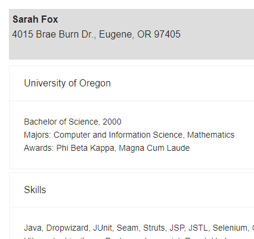

# ResumeDemo

This project is to demonstrate use of various technologies.  To start off with, it's demonstrating Dropwizard and React.  It parses the resume data into a pile of java objects on the backend, then serializes that to json which is then rendered by React on the frontend.  It uses AntD components for layout to make things look pretty.

# Roadmap
1. Swap in Jasmine test runner and create some front-end unit tests.  Jest (built in test runner) does not play nice with AntD components.
1. Get the backend talking to a database.  Postgres to start with.
1. Add in some user interactivity.  Allow creation of new skills/jobs/tasks.  Select type of resume to display - skill based resume, experience based, reference list.
1. Add in Progressive Web App features
1. New tech wishlist - try MongoDB, or Angular, or React Native.

# How to start the ResumeDemo application
1. Run `mvn clean install` to build your application
1. Start application with `java -jar target/ResumeDemo-0.0.1-SNAPSHOT.jar server config.yml`
1. To check that your application is running enter url `http://localhost:8080`

# To run the java unit tests
1. Run `mvn clean test`

# Health Check
To see your applications health enter url `http://localhost:8081/healthcheck`
